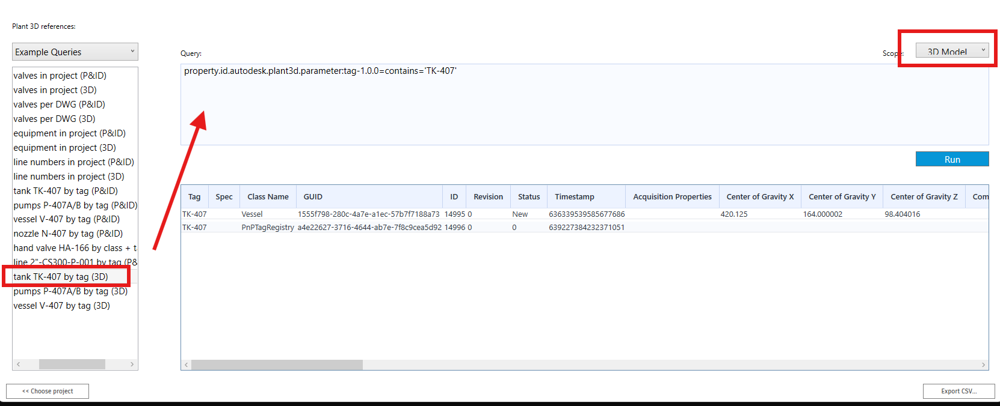
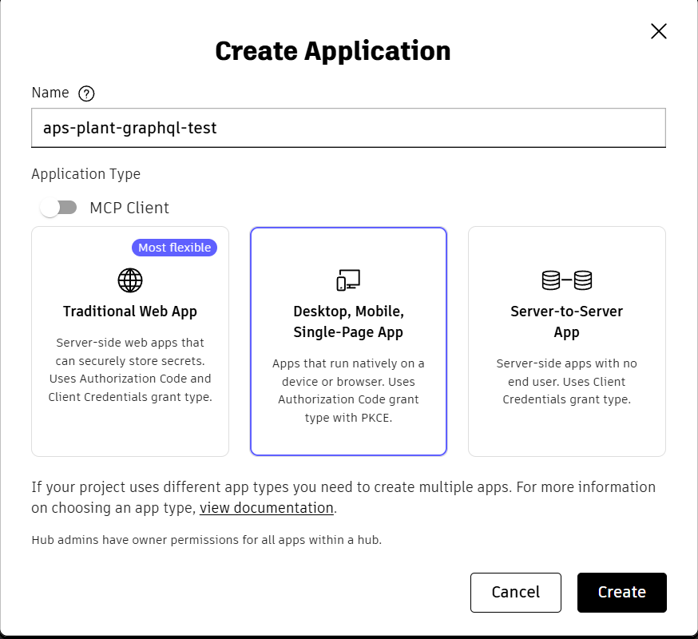

# Plant 3D AEC Data Model Explorer

A small tool to obtain OAuth tokens and run GraphQL queries against the Plant 3D AEC Data Model (AECDM) via Autodesk Platform Services (APS).

---

## Table of contents

- [Overview](#overview)
- [Prerequisites](#prerequisites)
- [Quick start](#quick-start)
- [Configuration — Client IDs](#client-ids)
- [Using the tool](#using-the-tool)
  - [Login](#login)
  - [Accounts](#accounts)
  - [Region](#region)
  - [Plant Collaboration Projects](#plant-collaboration-projects)
  - [Query view](#query-view)
    - [Scope](#scope)
    - [P3D References](#p3d-references)
    - [Query input](#query-input)
    - [Export CSV](#export-csv)
- [Troubleshooting](#troubleshooting)
- [Links](#links)
- [Contributing](#contributing)
- [Authors](#authors)

---

## Overview

This repository provides a small desktop explorer that helps you:
- Authenticate with Autodesk,
- Browse accessible Accounts and Plant Collaboration Projects,
- Run GraphQL queries against AECDM and export results to CSV.



<!-- TODO: demo video — drag & drop the recording into a GitHub PR/issue comment on
     autodesk-platform-services/aps-plant-graphql-explorer-app to get an asset URL,
     then replace this comment with:
     https://github.com/user-attachments/assets/<id>
-->

---

## Prerequisites

- Autodesk Construction Cloud / Docs access with appropriate permissions.
- Familiarity with GraphQL query syntax.
- A registered APS Integration (to get a Client ID for OAuth).

---

## Quick start

1. Add the integration Client ID into the application configuration (see next section).
2. Launch the app and click **Sign in with Autodesk**. Complete the OAuth flow.
3. Browse Accounts → select a Hub/Region → double-click a Plant Collaboration Project to open the Query view.

---

## Client IDs

This app is a desktop client and authenticates using **PKCE** (no client secret). When registering your integration at https://aps.autodesk.com, make sure to create it as a **Desktop, Mobile, Single-Page App** — not a Traditional Web App or Server-to-Server App:



Add the Client ID from your registered integration into the app's custom integration configuration. Example IDs used for this tool:

```
Staging		=>	"A74ztMCm6dFTk3tgtAR8IVbLLU7QsIqGHY6gnKb6WkWRvNdl"
Production	=>	"AoGLYso4FxislAIs7NOI5G0G6xOAuQhDBZOKDVSSccmvKnbF"
```

---

## Using the tool

### Login

After you complete the OAuth configuration, click **Sign in with Autodesk** and follow the standard Autodesk login flow.

### Accounts

After login, the first view lists all **Accounts** the current user can access. Double-click an account to view its Plant Collaboration Projects.

### Region

Now you can select the region on the Hubs view to indicate which region you'd like to working on.

### Plant Collaboration Projects

Items with the Plant icon are Plant Collaboration Projects.

- **Black icon**: The project supports AECDM
- **Red icon**: The project does not support AECDM, or the project is broken

### Query view

When you double-click a supported Plant Collaboration Project, you’ll see a query view where you can query data from AECDM.

#### Scope

Select the data source to query:

- 3D Model
- P&ID

#### P3D References

The dropdown contains three sections:

1. **Example Queries** — Examples to help you learn how to query AECDM
2. **All** — All Plant parameters you can use in queries
3. **Parameter Categories** — Parameters grouped into Categories

> Double-click an item to automatically insert its query snippet into the query input.

#### Query input

Enter your GraphQL query here. For filtering guidance, see:
- https://aps.autodesk.com/en/docs/aecdatamodel/v1/developers_guide/filtering/

#### Export CSV

Export the query results to CSV for downstream use.

---

## Troubleshooting

- **Network issues**: Check internet connectivity and any firewall or proxy settings that might block the app.

---

## Links

- [APS Documentation](https://aps.autodesk.com/en/docs)
- [GraphQL Documentation](https://graphql.org/learn/)
- [AEC Data Model Documentation](https://aps.autodesk.com/en/docs/aecdatamodel/v1/overview/)
- [AEC Data Model Tutorials — Before You Begin](https://aps.autodesk.com/en/docs/aecdatamodel/v1/tutorials/before_you_begin/)

---

## Authors

- Developed by Yuan Gu (Plant Engineering Team)
- Maintained by Madhukar Moogala (APS Team)

---
